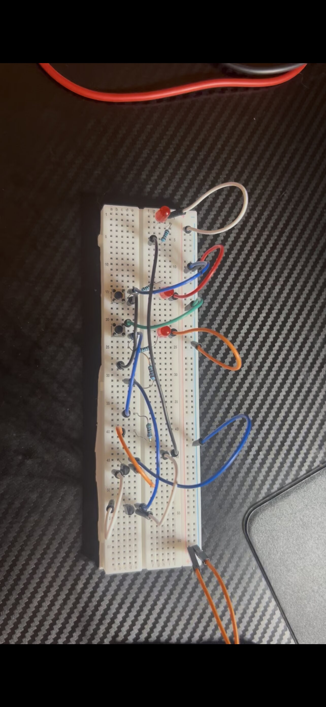

# Phase 1 — Discrete Logic

This phase introduces transistor-level digital logic by building a **NAND gate**, **AND gate**, and **half adder** using `2N2222A` NPN transistors.

  

## Goal

The goal was to understand how basic logic functions are built from individual transistors before moving on to integrated logic ICs.

## Circuits

### NAND Gate

Outputs LOW only when both inputs are HIGH.

  

### AND Gate

Built by inverting the NAND output. It outputs HIGH only when both inputs are HIGH.

  

### Half Adder

The half adder adds two 1-bit inputs and produces:

* **SUM** — XOR behavior
* **CARRY** — AND behavior

|  A |  B | Sum | Carry |
| -: | -: | --: | ----: |
|  0 |  0 |   0 |     0 |
|  0 |  1 |   1 |     0 |
|  1 |  0 |   1 |     0 |
|  1 |  1 |   0 |     1 |

  

## Problems Encountered

The main challenges were correctly identifying transistor pinouts, preventing floating inputs, and debugging wiring mistakes in circuits built entirely from discrete components.

## What I Learned

This phase reinforced:

* Transistors as digital switches
* Boolean logic
* NAND, AND, and XOR behavior
* Binary addition
* Pull-down resistors
* Incremental circuit testing

## Demo

Demonstrations are available in the [`demo`](demo/) folder.

## Next Phase

[Phase 2 — 2-Bit Adder/Subtractor](../02-2bit-adder/)
