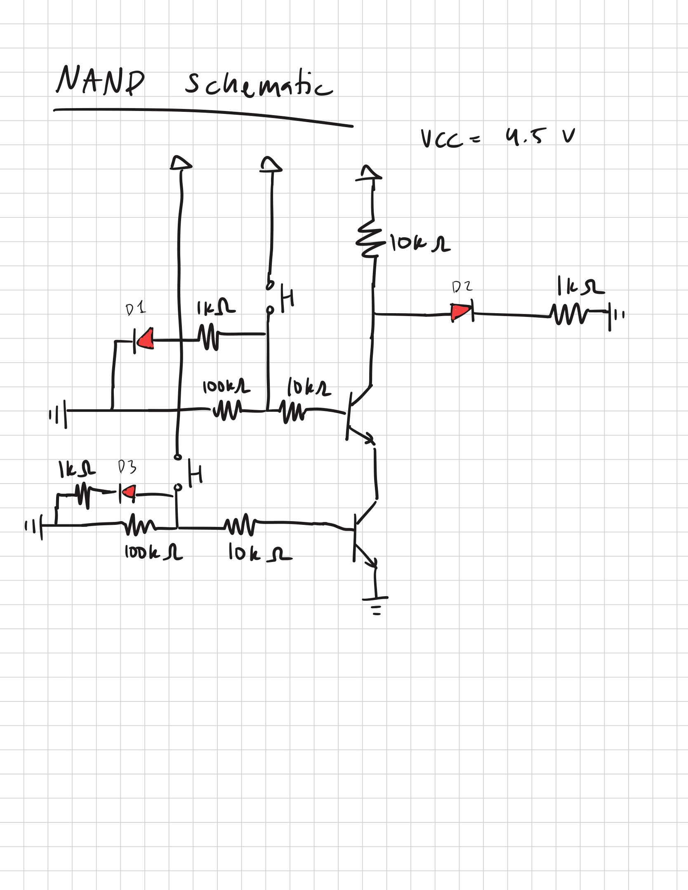
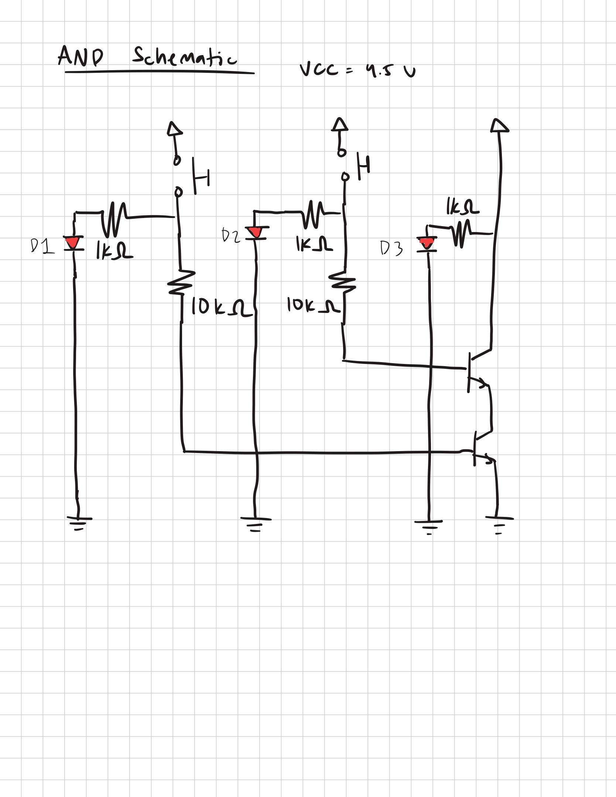
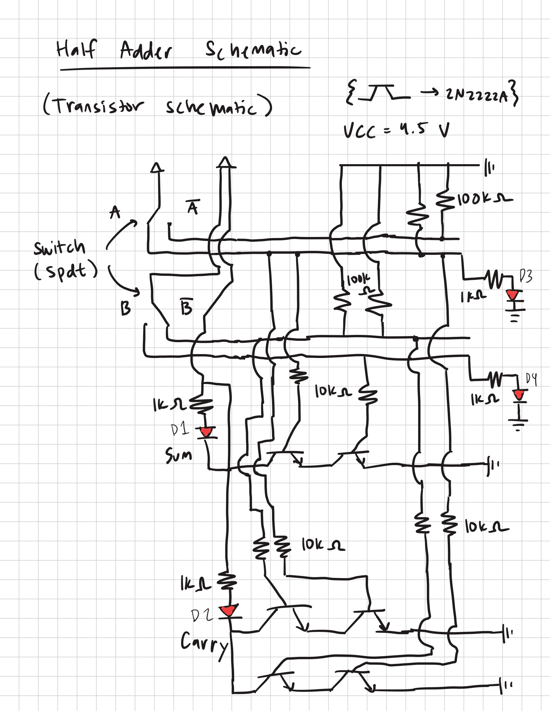
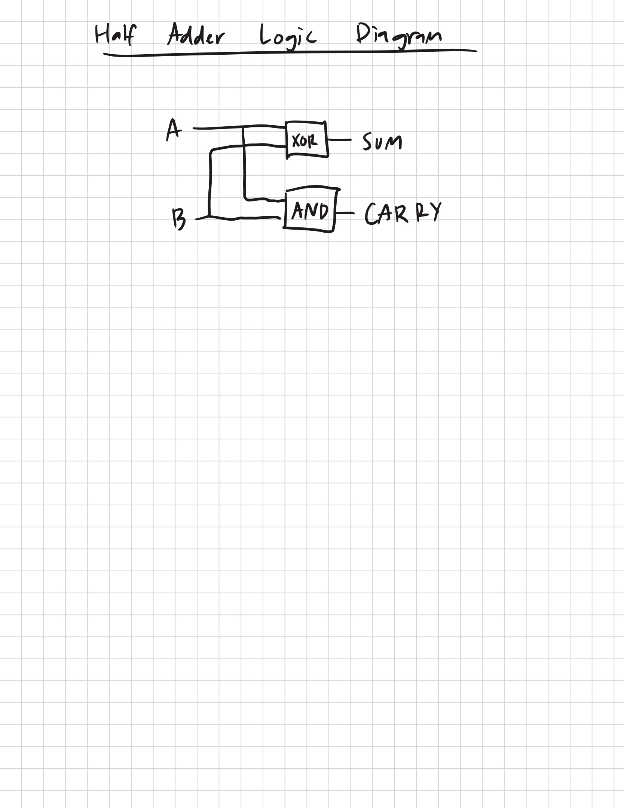

# Discrete Logic Schematics

## NAND Gate

This schematic represents the NAND gate made in the project. Diodes D1 and D3 represent the input bits with a red LED. Diode D2 displays the output bit. The transistors used are the PN2222a's. 100k ohm resistors are used as pulldowns for the pushbuttons.

## AND Gate

This schematic shows the AND gate made in the project. Diodes D1 and D2 represent the input bits with a red LED. Diode D3 represents the output bit.

## Half Adder 

This schematic shows the half adder made in the project. Diodes D3 and D4 represent inputs A and B. Diodes D1 and D2 display Sum and Carry respectively. The transistors used are the PN2222a's. 100k ohm resistors are used as pulldowns for each input. SPDT switches are also used for each input. An additional logic diagram is depicted below.
