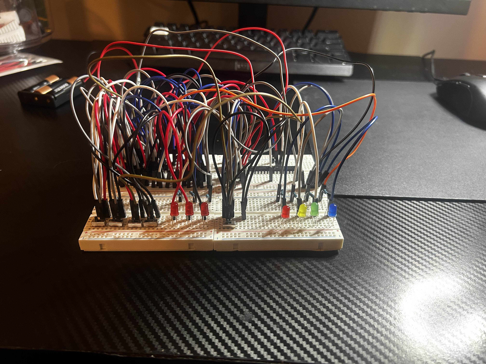

# Phase 2 — 2-Bit Adder/Subtractor

This phase expands the half-adder concept into a **2-bit adder/subtractor** capable of performing binary addition and subtraction. It also marks the transition from discrete transistor logic to **74HC-series logic ICs**.

  

## Goal

The goal was to learn how single-bit arithmetic circuits can be chained together into a multi-bit system while introducing reusable HC74 logic chips for the core logic functions.

## How It Works

Two 2-bit inputs are processed through a ripple-carry adder.

Subtraction is implemented using two's-complement arithmetic by inverting the B input and adding `1`. A control input selects between ADD and SUB modes.

This phase uses 74HC-series logic ICs such as XOR, AND, OR, and inverter chips instead of building each gate from individual transistors.

## Flags

The circuit also includes four arithmetic status flags:

* **Zero** — result is `00`
* **Negative** — most significant result bit is `1`
* **Carry** — carry out from the final stage
* **Signed Overflow** — signed result exceeds the 2-bit range

## Problems Encountered

The main challenges were handling carry between stages, correctly implementing two's-complement subtraction, and distinguishing carry from signed overflow.

Testing edge cases was especially important for verifying the flag behavior.

## What I Learned

This phase reinforced:

* Ripple-carry addition
* Two's-complement subtraction
* 74HC-series logic ICs
* Carry propagation
* Signed versus unsigned arithmetic
* Arithmetic status flags
* Multi-bit circuit debugging

* While making the first build of the 2-bit Adder/Subtractor I didn't take any wiring notes. This caused me to
 forget where multiple connections went, ultimately leading me to redo the whole build. This taught me the importance of taking wiring notes
 in order to always know where the wires go, especially when working in a dense wire environment.

## Demos

* [2-Bit Adder/Subtractor Demo](demo/)
* [Flags Demo](demo/)

## Next Phase

[Phase 3 — 4-Bit ALU](../03-4bit-alu/)
