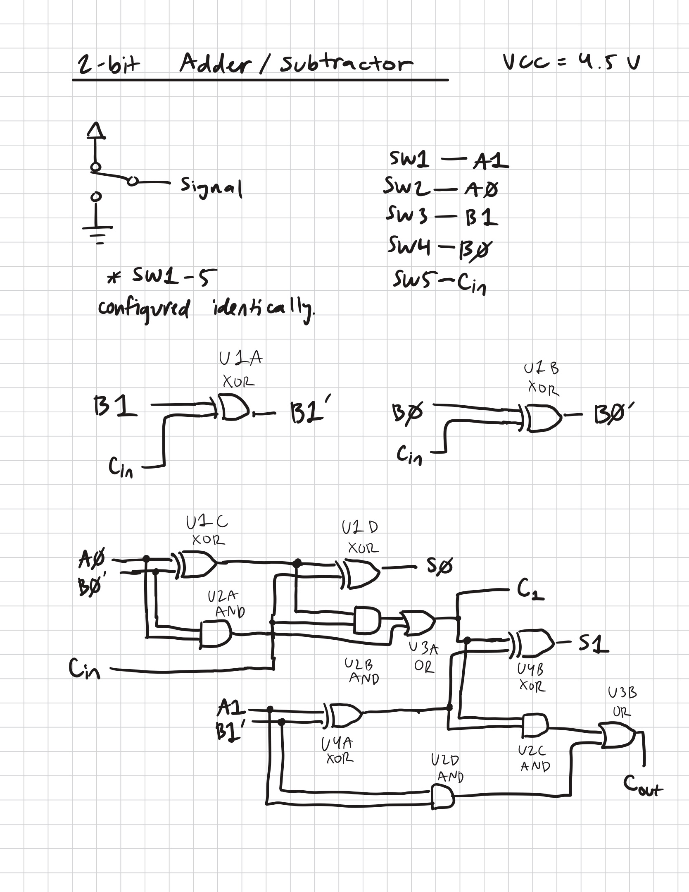
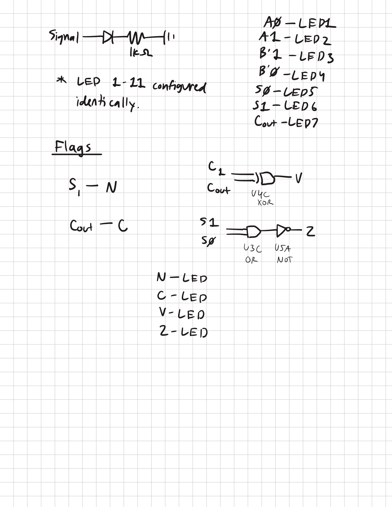

# 2-bit Adder/Subtractor Schematics

U1,U4 = SN74HC86N
U2 = SN74HC08N
U3 = SN74HC32N
U5 = SN74HC04N

A0,A1,B0,B1, and Cin are all wired identically with an SPDT switch to control ON and OFF.
Cin acts as 'SUB', inverting the B input for 2's compliment and acting as a carry input for the adder.
All inputs, flags, and outputs are displayed with a 1k ohm resistor and LED. (A0,A1,B'0,B'1,Z,V,N,C,S0,S1)
