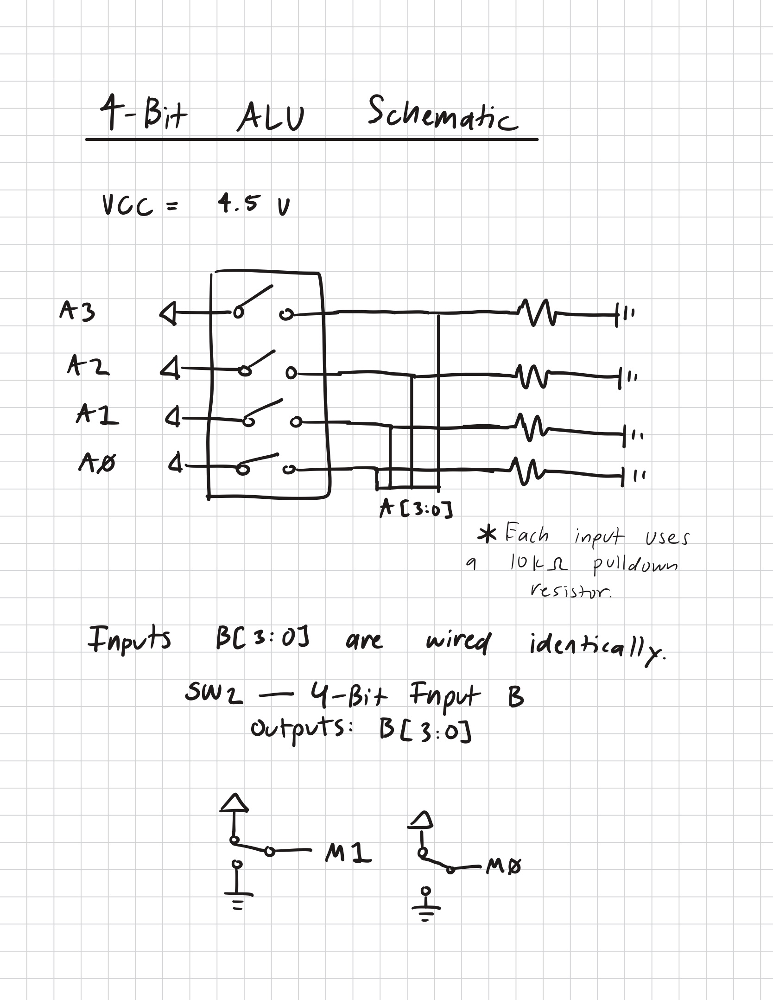
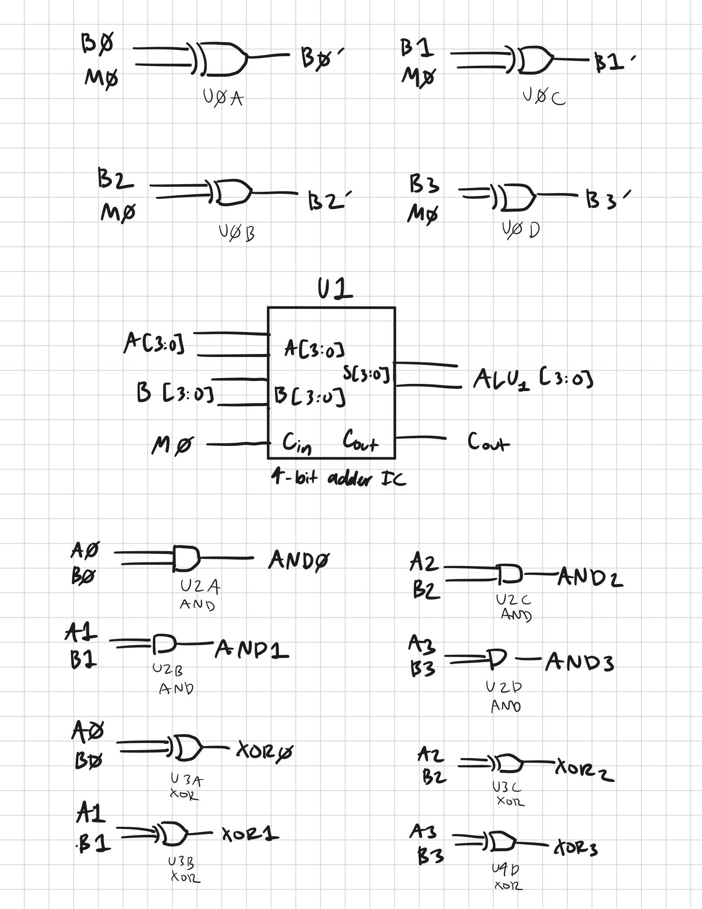
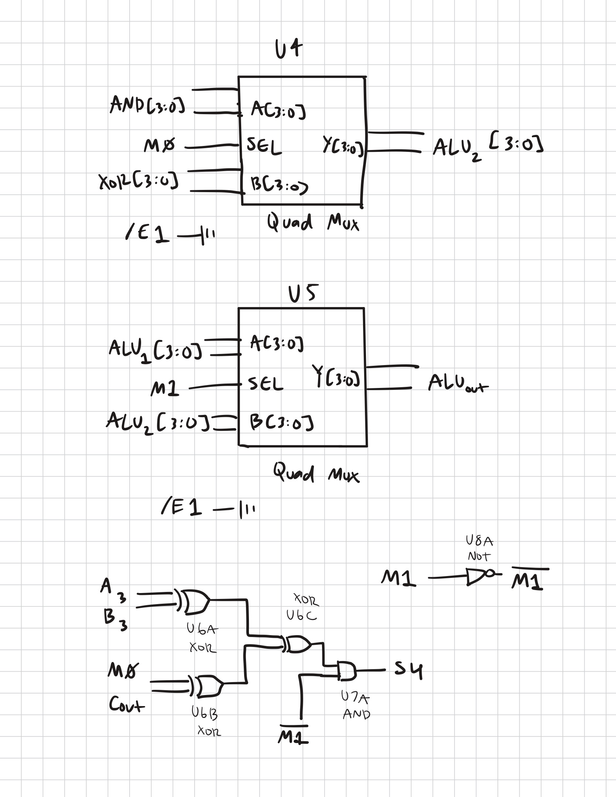
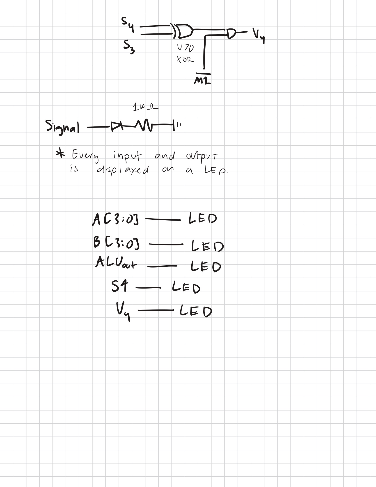

# 4-bit ALU Schematic

Inputs A and B are both wired identically. Each input uses a 4-switch block and a 10k ohm resistor as a pulldown.

U1,U4,U7 = SN74HC86N
U2= SN74HC283N
U3,U8 = SN74HC08N
U5,U6 = SN74HC157N

Each input and output are displayed on a LED with a 1k ohm resistor. (A[3:0],B[3:0],ALUout[4:0],V4)
Each quad mux gate has /E1,/E2 grounded.
S4 represents a fifth output bit. V4 represents a 4-bit overflow.
S4 and V4 only turn high when ALU is in add or subtract mode.
