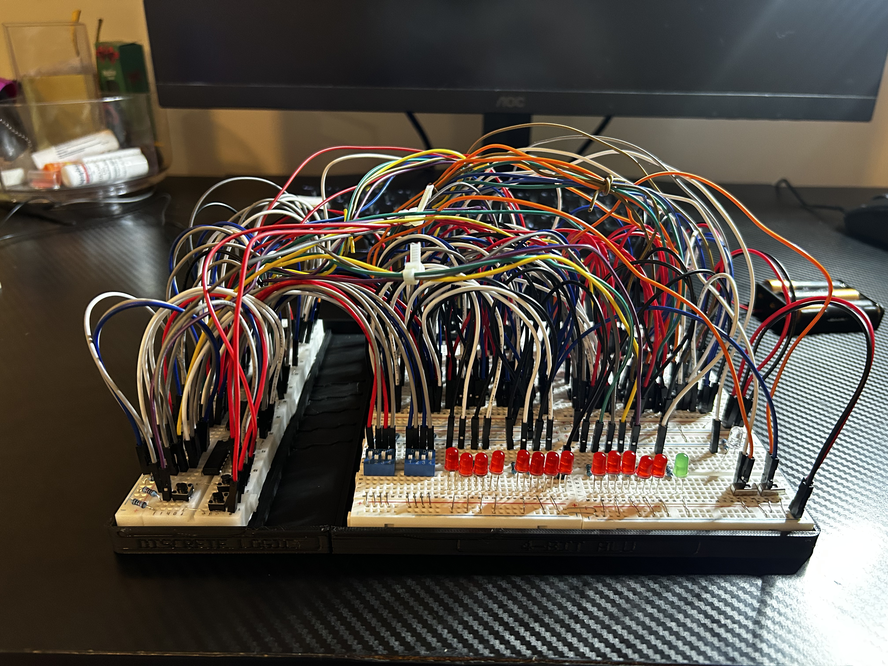

# Phase 4 — Registers

This phase adds **input and output registers** to the ALU, allowing values to be stored instead of depending directly on the switch positions. This phase also includes the **3D-printed enclosure** used to organize and present the final breadboard assembly.

  

## Goal

The goal was to introduce data storage and make the ALU behave more like a true datapath.

Three `SN74HC173N` 4-bit registers were added:

* **A Register** — stores input A
* **B Register** — stores input B
* **Output Register** — stores the ALU result

## How It Works

The A and B switch inputs are loaded into their respective registers, where the values remain stored until a new value is loaded or the system is reset.

The ALU operates on the stored A and B values, and its result can then be captured by the output register.

The `SN74HC173N` control pins are used to determine when each register loads data, while the shared reset line clears the stored values.

## 3D-Printed Enclosure

During this phase, I also designed and 3D printed a custom enclosure for the breadboard assembly.

The enclosure was modeled to:

* Hold both breadboards in position
* Preserve the spacing between the boards
* Improve the presentation of the project
* Keep the controls and LEDs easily accessible

Several fit tests were printed before settling on the final design.

## Problems Encountered

The main challenges were understanding the active-low enable and reset inputs on the `SN74HC173N`, correctly controlling when data was stored, and integrating the registers without disrupting the existing ALU circuitry.

The enclosure also required multiple fit tests to achieve the desired breadboard angle and spacing.

## What I Learned

This phase reinforced:

* Clocked data storage
* 4-bit registers
* Active-low control signals
* Separating stored data from live switch inputs
* Datapath design
* Register-based system integration
* Basic enclosure design and 3D-print prototyping

## Demo

* [Register Demo](demo/)

## Next Phase

[Phase 5 — Clock Circuit](../05-clock/)
