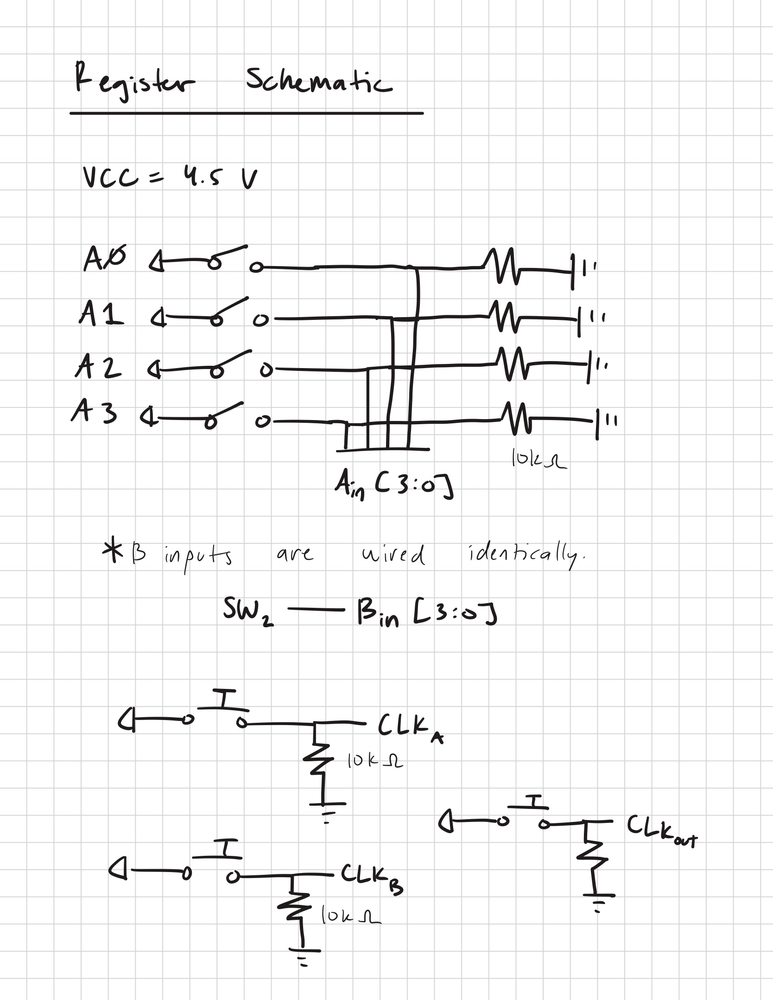

# Registers Schematic

Inputs A and B are wired identically. Each clock pushbutton uses a 10k ohm resistor as a pulldown. /E1,/E2,MR is grounded on each register

U1,U2,U3 = SN74HC173N (4-bit register)

Once loaded into the registers, Aout and Bout are used as the A and B inputs in the ALU itself.

All registered inputs and outputs are displayed on an LED with a 1k ohm resistor. (Aout[3:0],Bout[3:0],OUT[3:0])
