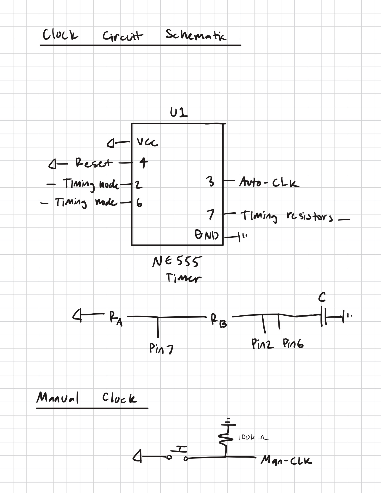
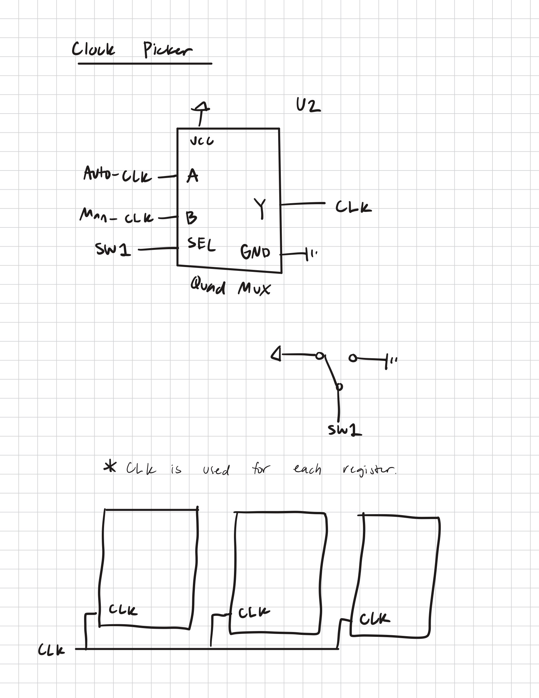
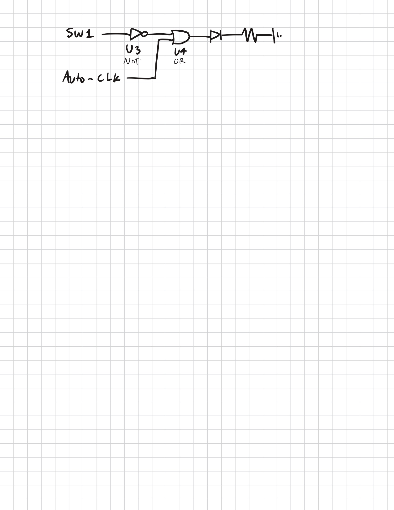
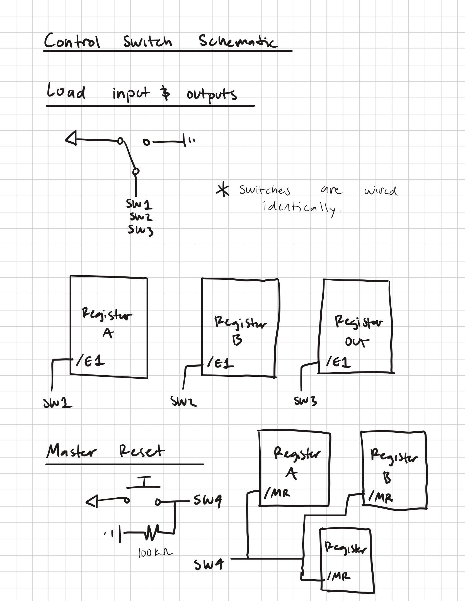

# Clock and Control Switches Schematic

## Clock circuit

Ra = 100kOhm, Rb=50kOhm, C=10microF. However, values could be changed for an alternative clock period. With the values
listed, it is about 0.693(100k+2(56k))(10mF) = 1.47s

A pushbutton with a 100k ohm pulldown is used as a manual clock input. Then a mux with an SPDT SEL input is used to select between manual and auto mode. 

An indicator LED is made with NOT(SW1) OR Auto-CLK to flash whenever auto mode is on, but stay solid when manual mode is on.

U1 = NE 555 Timer
U2 = SN74157N

## Control Switch Schematic

Three SPDT switches control the active-low register pins to have the registers load only if the switches are off.
Also, the active-high /MR pins are used with a pushbutton with a 100k ohm pulldown in order to clear the registers.
