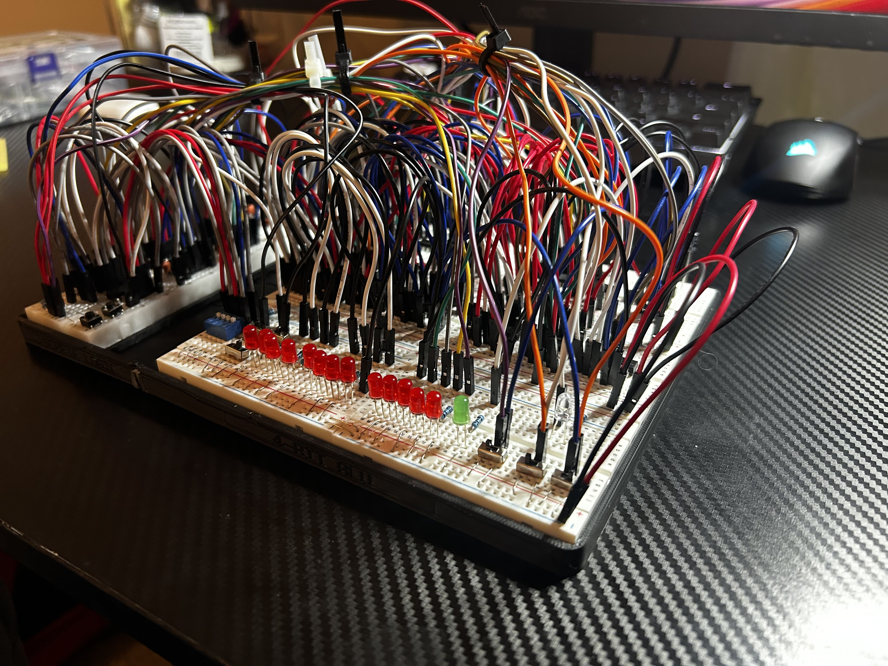

# Clocked 4-Bit ALU with Registers

<p align="center">
  
</p>

A 4-bit arithmetic logic unit built on a breadboard and designed from the transistor level upward, featuring arithmetic and logic operations, input/output registers, manual and automatic clocking, and instruction-like control signals.

## Overview

This project explores the fundamentals of digital computer architecture by building a functional 4-bit ALU system from discrete logic and 74HC-series integrated circuits.

The project progressed incrementally from individual transistor logic gates to a complete system capable of storing operands, performing arithmetic and logical operations, and capturing results using clocked registers. Explore each incremental phase with the phase folders in the repo. (e.g. '01-', '02-', etc.)

### Features

* 4-bit A and B input registers
* 4-bit output register
* 5-bit arithmetic output
* Four ALU operations:

  * `00` — ADD
  * `01` — SUB
  * `10` — AND
  * `11` — XOR
* Manual clock input
* NE555 automatic clock
* Manual / automatic clock selection
* Load A control
* Load B control
* Store Output control
* Global reset
* LED visualization of inputs, outputs, and clock state

## Architecture

```text
Input Switches
     │
     ├────> A Register ────┐
     │                     │
     └────> B Register ────┤
                           ▼
                       4-Bit ALU
                           │
                           ▼
                     Output Register
                           │
                           ▼
                      Output LEDs
```

## ALU Operations

| Mode | Operation |
| ---- | --------- |
| `00` | ADD       |
| `01` | SUB       |
| `10` | AND       |
| `11` | XOR       |

Controlled using mode switches and multiplexers inside the ALU.

Example arithmetic operations:

| Operation     | Result  |
| ------------- | ------- |
| `1111 + 0001` | `10000` |
| `1000 + 1000` | `10000` |
| `0101 - 0011` | `00010` |
| `0000 - 0001` | `11111` |
| `1010 - 1010` | `00000` |

## Project Development

The system was developed in stages so each subsystem could be designed, tested, and debugged independently.

1. Discrete transistor logic
2. Half adder
3. 2-bit adder/subtractor
4. Arithmetic flags
5. 4-bit ALU
6. Registers
7. Manual and automatic clock
8. Control system
9. Final integration and enclosure

(Some stages are combined in the repo folders in order to avoid repetitiveness)

## Hardware

Major components include:

| Component    | Purpose                   |
| ------------ | ------------------------- |
| `SN74HC283N` | 4-bit binary adder        |
| `SN74HC157N` | Quad 2-to-1 multiplexers  |
| `SN74HC173N` | 4-bit registers           |
| `SN74HC86N`  | XOR gates                 |
| `SN74HC08N`  | AND gates                 |
| `SN74HC32N`  | OR gates                  |
| `SN74HC04N`  | Inverters                 |
| `NE555`      | Automatic clock generator |
| `2N2222A`    | Discrete transistor logic |

See the full [Bill of Materials](BOM.md) for component quantities and sourcing information.

## Demonstrations

Video demonstrations are included throughout the repository showing the development and operation of individual subsystems.

Demonstrations include:

* NAND gate
* AND gate
* Half adder
* 2-bit adder/subtractor
* Arithmetic flags
* 4-bit ALU
* Register control
* Clock circuit
* Control switches
* Final integrated build

## Documentation

Additional documentation includes:

* System architecture
* Schematics
* IC reference guide
* Testing procedures
* Debugging notes
* Design decisions
* Lessons learned
* Bill of materials

## What I Learned

This project provided hands-on experience with:

* Modular system design
* Transistors for gate design
* Boolean logic implementation
* Ripple-carry addition
* Multiplexer-based datapath design
* Clocked register operation
* Control signals
* Timing and synchronization
* Breadboard power distribution
* Decoupling and signal integrity
* Incremental hardware debugging

## Final Result

The completed system functions as a manually controlled 4-bit datapath capable of loading operands into registers, selecting an ALU operation, calculating a result, and storing that result in an output register using either manual or automatic clock pulses.

While it is not a complete programmable CPU, it implements several of the core hardware concepts used inside one: **registers, an ALU, clocking, control signals, and a datapath.**
